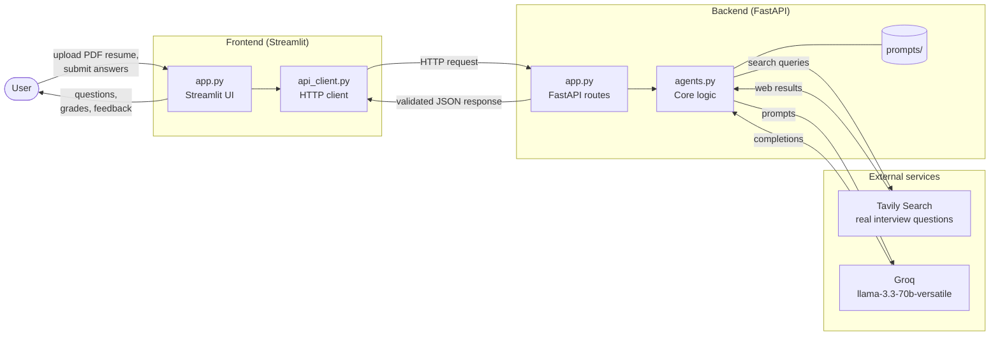

# AI Technical Interview Prep (Web App)

Upload a PDF resume, get real interview questions found on the web via Tavily Search, and be graded by an adaptive AI interviewer powered by Groq (llama-3.3-70b-versatile).

## Structure
The backend handles LLM interactions and search; the frontend handles the UI.

    project/
    ├── backend/
    │   ├── app.py              # FastAPI server
    │   ├── agents.py           # Core logic (Tavily search + Groq calls)
    │   ├── prompts/
    │   ├── tests/
    │   └── requirements.txt    # backend-only dependencies
    ├── frontend/
    │   ├── app.py              # Streamlit UI
    │   ├── api_client.py       # HTTP client 
    │   └── requirements.txt    # frontend-only dependencies
    ├── docs/
    │   ├── ARCHITECTURE.md     # Architecture documentation
    │   └── CHANGES.md          # Refactoring logs
    └── .env.example

## Architecture



**Request flow**

1. The user uploads a PDF resume (and later submits answers) in the Streamlit UI.
2. `api_client.py` sends the request over HTTP to the FastAPI backend.
3. `agents.py` uses Groq to interpret the resume and drive the interview, and Tavily to find real interview questions on the web.
4. The backend validates the data exchanged with each service and returns a JSON response, which the UI renders.

## Setup

Set up your `.env` file first:
```bash
cp .env.example .env
# Edit .env and supply GROQ_API_KEY and TAVILY_API_KEY
```

Install backend dependencies and run the server:
```bash
cd backend
python -m venv .venv
# activate venv (.venv/bin/activate or .venv\Scripts\Activate.ps1)
pip install -r requirements.txt
cd ..
uvicorn backend.app:app --reload
```

In a second terminal, install frontend dependencies and run the app:
```bash
cd frontend
python -m venv .venv
# activate venv
pip install -r requirements.txt
cd ..
streamlit run frontend/app.py
```

## How it works

See `docs/ARCHITECTURE.md` for data contracts. The frontend makes HTTP requests to the backend. The backend delegates language tasks to Groq and web searches to Tavily, strictly validating all data in between layers before returning JSON responses.
